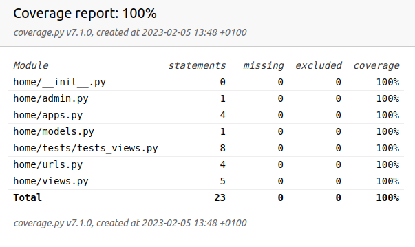

### THE PINK PANTHER 

### Installation
* Clone the repository 
```
$ git clone https://github.com/MarcinSerwinski/pink_panther.git
```
* Create virtual environment to install dependencies and activate it:
```
$ python -m venv venv
$ source venv/bin/activate
```
* Install the dependencies:
```
(venv)$ pip install -r requirements.txt
```
* Prepare migrations:
```
$ python manage.py makemigrations
```
* Make migrations:
```
$ python manage.py migrate
```
* Start dev server:
```
$ python manage.py runserver
```
* Check http://127.0.0.1:8000/

## Unit test



